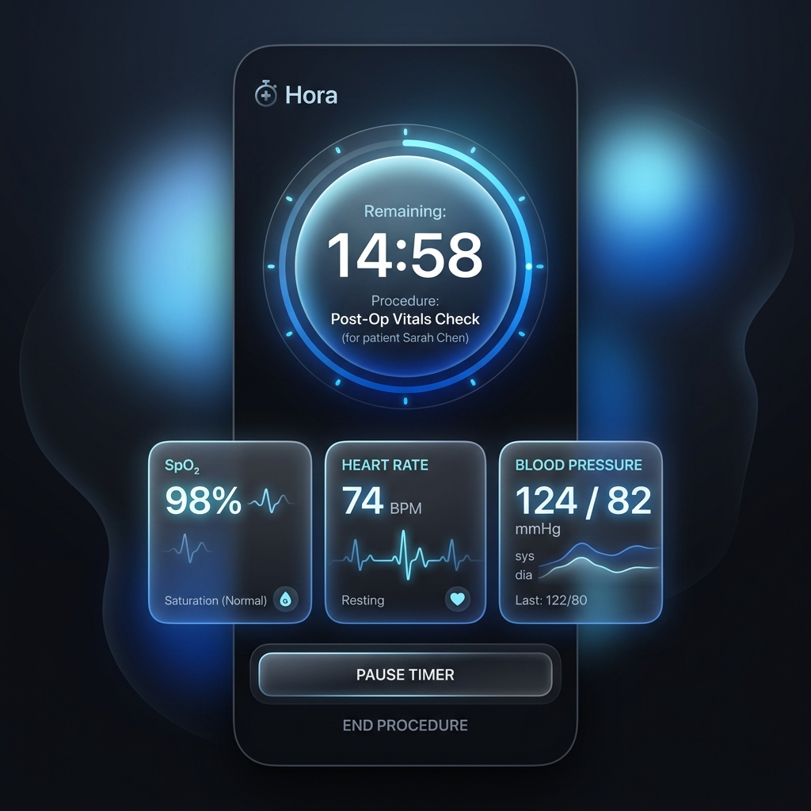

# 🩺 Hora — Premium Glassmorphic Clinical Assistant

[](https://flutter.dev)
[](https://pub.dev/packages/provider)
[](https://pub.dev/packages/sqflite)
[](#)

**Hora** (meaning *Hour* or *Time*) is an elegant, high-reliability clinical helper and countdown timer app designed for healthcare professionals. From tracking patient vitals to monitoring timed clinical procedures (such as IV drip rates and nebulizer therapies), Hora delivers essential safety protections with active background execution and persistent system-level alerts. 



## 📋 Table of Contents
- [🎯 Primary Medical Scenarios](#-primary-medical-scenarios)
- [✨ Core Capabilities](#-core-capabilities)
- [🛡️ Clinical Safety & Privacy Guardrails](#-clinical-safety--privacy-guardrails)
- [⚙️ Technical Architecture & Directory Structure](#-technical-architecture--directory-structure)
- [📦 Embedded Dependencies](#-embedded-dependencies)
- [🚀 Local Setup & Installation](#-local-setup--installation)

---

## 🎯 Primary Medical Scenarios

### 💉 IV Infusion & Medication Drip Rate Checks
Set a target duration (e.g. 45 minutes) for an infusion. The app requires inputting the patient's ID/name, age, and weight along with baseline vitals (SPO2, blood pressure) before commencing. When the countdown completes, a full-screen system-level overlay rings persistently, ensuring the infusion is checked immediately.

### ⏱️ Scheduled Patient Vitals Logging
When administering high-risk drugs that require monitoring every 10 or 15 minutes, set an **Interval Alert**. Hora will chime softly at each interval, prompting you to log current SPO2 and BP, creating an offline timeline of the patient's reaction.

### 🌬️ Therapy Cycle Management
For timed cycles like nebulizer therapy or oxygen cycles, run quick timer presets. The background service prevents task termination, ensuring you are alerted immediately when the cycle ends.

### 📋 Shift Checklist & Handovers
Log clinical duties, surgery preps, and daily ward checklists. Register quick, temporary reminders as **Temporary Tasks**—these automatically self-destruct from the offline SQLite database after 7 days, maintaining a clean shift log.

---

## ✨ Core Capabilities

### ⚡ Background Service Execution
Powered by a persistent foreground thread using `flutter_background_service`. Timers remain completely accurate and active even if the app is minimized, closed, or the screen is locked.

### 🛎️ Over-Other-Apps (Overlay) Alarm System
Utilizing `system_alert_window`, an urgent full-screen overlay pops on top of whatever app is active or when the screen is locked, ensuring critical timed events are never missed.

### 📊 Offline Patient Charting & Vitals Logs
Offline-first database (`sqflite`) storing patient records and vital logs over time. Complete relational integrity with cascade deletes.

### 🎵 Curated Alarm Configurations
Toggle alerts between Sound, Vibration, or Both. Choose from medical ringtones (*Clinical Beep*, *Vital Alert (Soft)*, *Emergency Pulse*, *IV Completion Blip*) or upload custom files.

### 🎨 Glassmorphic Interface
Premium UI with a "Liquid Glass" theme, backdrop blur filters, and micro-animations, reducing visual clutter under stress.

---

## 🛡️ Clinical Safety & Privacy Guardrails

*   **Offline Data Privacy (HIPAA Alignment):** All data is stored locally in `hora_database.db`. No data is uploaded or synced to external servers, providing full offline privacy for patient metrics.
*   **Anti-Kill Process Protection:** Uses a persistent foreground service (`timer_foreground` channel) to bypass the Android OS battery saver task killer.
*   **Vitals Entry Enforcement:** Prevents launching procedure timers without entering initial baseline vitals, guaranteeing a recorded medical log.

---

## ⚙️ Technical Architecture & Directory Structure

```text
lib/
├── core/
│   ├── app_themes.dart      # Curated themes (Liquid Glass, Dark, Light)
│   └── db_helper.dart       # SQLite DB initialization, queries, and auto-cleanup
├── models/
│   ├── patient_model.dart   # PatientModel and VitalsRecord schemas
│   └── task_model.dart      # TaskModel structure and temporary tasks definitions
├── features/
│   ├── clinical/            # Patient list and logging panels
│   ├── home/                # Main scaffold and clinical dashboard
│   ├── notifications/       # Local notification configurations
│   ├── tasks/               # Shift list manager & task service provider
│   └── timer/               # Background services and procedural clock
├── widgets/
│   └── glass_container.dart  # Glassmorphic container backdrop layout
└── main.dart                # App bootstrap & service initializers
```

---

## 📦 Embedded Dependencies

*   **State Management:** `provider`
*   **Database:** `sqflite` & `path`
*   **UI & Design:** `google_fonts`, `flutter_staggered_animations`
*   **Services:** `flutter_background_service`, `flutter_local_notifications`, `system_alert_window`, `android_alarm_manager_plus`
*   **Hardware/Media:** `audioplayers`, `vibration`, `file_picker`

---

## 🚀 Local Setup & Installation

### Prerequisites
*   **Flutter SDK:** `^3.10.7`
*   **Android Target:** SDK 23+ (Android 6.0+) for overlay permissions and background services.

### Installation Steps

1.  **Clone the Repository:**
    ```bash
    git clone https://github.com/amal-infosec/Hora.git
    cd Hora
    ```

2.  **Pull Packages:**
    ```bash
    flutter pub get
    ```

3.  **Permissions Verification:**
    Verify your test device grants **Display over other apps** and **Notifications** permissions upon prompt.

4.  **Run App:**
    ```bash
    flutter run
    ```
